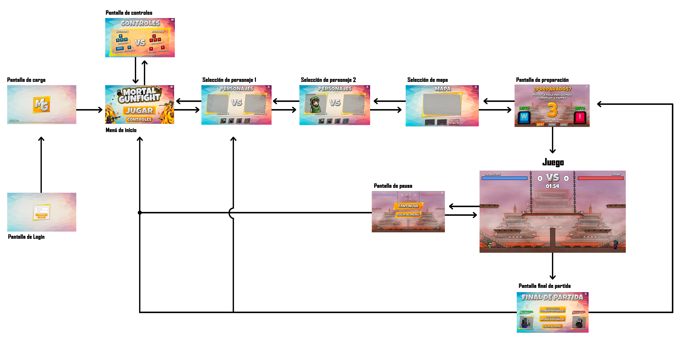
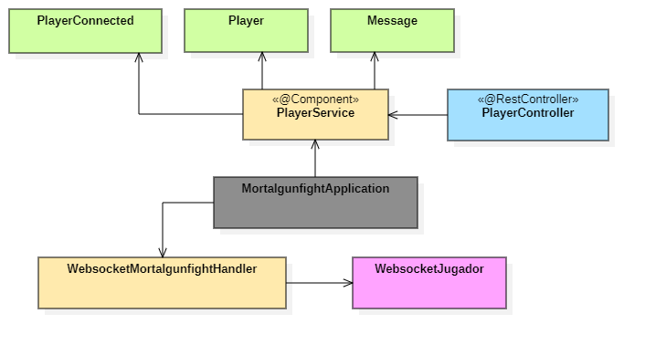

# Mortal Gunfight 🔫

Mortal Gunfight es un juego desarrollado como un proyecto académico para la asignatura de Juegos en Red del grado de Diseño y Desarrollo de Videojuegos (URJC).
Este juego enfrenta en una batalla 1vs1 a dos jugadores, donde el que más bajas consiga al finalizar el tiempo de la partida gana.
    

## Intengrantes del equipo de desarrollo ✒️
  
- Miguel Ferrer García \ 📧 m.ferrerg.2018@alumnos.urjc.es \ 🐱 [Mike-FG](https://github.com/Mike-FG)
- Roberto Herencias Muñoz \ 📧 r.herencias.2018@alumnos.urjc.es \ 🐱 [Robertus06](https://github.com/Robertus06)
- Alejandro Quintana del Pino \ 📧 a.quintana.2018@alumnos.urjc.es \ 🐱 [alejandroquintanadelpino](https://github.com/alejandroquintanadelpino)
- Luis Torres Valera \ 📧 l.torresv.2018@alumnos.urjc.es \ 🐱 [LuisTorres19](https://github.com/LuisTorres19) 

[Tablero Trello](https://trello.com/b/dxJ0Y8J8/mortal-gunfight)

---

## Documento de Diseño de Juego 📄

### Descripción del juego

Es un juego en el que nos enfrentaremos a un amigo en un escenario en 2D, con un variado arsenal de armas que aparecen de manera aleatoria por el mapa y han de ser recogidas para pelearse.

Este juego mezcla el habitual escenario de plataformas con un juego shooter donde el personaje que consiga más bajas antes que finalice el contador de tiempo obtiene la victoria. Además, podrás elegir entre un variado catálogo de personajes diferentes con características muy especiales.

El objetivo principal del juego es pasar un buen rato con un amigo, ya sea desde el mismo ordenador o en línea, sin tener que centrarte en una historia complicada.

### Género

El juego es principalmente de tipo casual, ya que posee reglas simples para cualquier jugador, con baja dificultad, pensado para cortos espacios de tiempo y altamente rejugable. Además, el juego es multijugador, principalmente pensado para dos personas; en línea, con opción de juego local y de navegador, ya que está pensado para jugarlo en un navegador web.

Además, entraría dentro del género de acción, lucha y shooter, ya que contiene peleas y disparos entre los jugadores.

### Plataforma

El juego es para ordenador, pensado principalmente para navegador web y programado con JavaScript, con el framework Phaser 3.

### Público

El juego está dirigido a todos los públicos, sean de la edad que sean, ya que solo se busca dar diversion con partidas cortas.

### Storyline y Personajes

El juego no tiene una historia ya que se basa en combates entre los jugadores.
Todos los personajes son iguales en cuanto a características y solo cambian estéticamente, para hacer las batallas lo más entretenidas y equilibradas posible.

| **Personaje**             | **Descripción**           | **Información Adicional** |
| --------------------- | --------------------- | --------------------- |
| Toby y Mr. Blind 👨🏾‍🦯 🦮|Mr. Blind es un hombre ciego que tiene un perro llamado Toby que le ayuda en las batallas.|Cuando coge un arma, Toby se pone a dos patas y es el que dispara. ¿Cómo iba a disparar Mr. Blind si está ciego? |
| The BillyRex 🦖| The BillyRex es un flipado de los dinosaurios que va a todos sitios vestido de dinosaurio. Incluso al campo de batalla. | The BillyRex está tan flipado que incluso ruge como un dinosaurio. |
| El Cojo Ninja | El Cojo Ninja lleva entrenando las técnicas del ninjutsu toda su vida y está preparado para enfrentarse a cualquiera. | Nadie sabe de donde proviene su nombre, pero todos saben que no es precisamente cojo. |
| Zombie 🧟‍♂️ | El Zombie ha regresado de entre los muertos y está dispuesto a comerse a todos los seres vivos que se encuentre. | El Zombie usa uno de sus brazos para agarrar el otro ya que se le cayó hace mucho tiempo y atacar con él. |

### Gameplay

El juego se basa en combates de 1 vs 1 contra algún amigo. Está pensado para ser jugado en ordenador mediante interacción por teclado.
Cuenta con un único modo de juego, Deathmatch, en el cual tendrás que ser el jugador con más bajas al finalizar el tiempo de la partida para lograr la victoria. En caso de producirse un empate, se activará el modo, Extra-Time, donde ganará el jugador que realice la próxima baja.

#### Mecánicas del Gameplay

El jugador podrá moverse a la izquierda, a la derecha, saltar, agacharse, disparar y al pasar por encima de las armas que se encuentran en el mapa de forma aleatoria, podrá recogerlas para usarlas contra el oponente. Para cambiar de arma, el jugador soltará el arma que porta dejándola en el suelo y cogerá el arma encontrada en el juego.
La mecánica principal de disparo permitirá al jugador disparar en todo momento a su oponente. El propio juego apunta automáticamente al jugador contrario, pero al disparar, la bala no persigue al oponente, se mantiene en la dirección de salida. La cámara se encuentra fija mirando hacia el escenario y viendo a los personajes de lado ya que es un juego en dos dimensiones.
Cada jugador tendrá una barra de vida que se reducirá al recibir disparos. Cuando la barra de vida llega a cero el otro jugador sumará una baja, y el jugador eliminado reaparecerá con toda la vida de nuevo.
El daño infligido dependerá del arma, siendo mayor con un arma pesada (instakill) y siendo menor con armas de gran cadencia (hasta veinte balas).

#### Diseño de Nivel

Los niveles son de plataformas con diferentes alturas. No cambia la dificultad entre ellos, pero suponen un cambio estético, creando escenarios con características ambientadas en cada personaje.

| **Niveles** | **Descripción** |
| ------------ | ------- |
| Long Street |Este escenario corresponde a Toby y Mr. Blind. Es una ciudad en la que hay coches como obstáculos. |
| Zona Volcánica |Este escenario corresponde a The BillyRex. Es un volcán en erupción en el que hay piedras que funcionan de obstáculo al moverse por él. |
| Templo Akaliux | Este escenario corresponde a El Cojo Ninja. Es un templo de la era Edo de Japón en el que hay rocas colgando de cadenas que actúan como plataforma. |

### Controles

Las teclas utilizadas en el juego, en su modalidad local (los dos jugadores en el mismo teclado), son:

| **Botón 1** | **Botón 2** | **Acción** |
|-----|------|------|
|W|I|Salto|
|A|J|Movimiento a la izquierda|
|D|L|Movimiento a la derecha|
|S|K|Tumbarse|
|Shift Izq.|B|Disparar|
|E|O|Intteractuar(Cambiar arma)|

### Estética del juego e Interfaz de usuario

El juego tiene una estética cartoon ya que tanto los personajes como los escenarios son dibujos en dos dimensiones.
En cuanto a la interfaz de usuario se puede observar las bajas de cada jugador, identificadas de color azul para el jugador 1, y de color rojo para el jugador 2; y las barras de vida de cada jugador, junto con el nombre de su personaje, y las balas restantes del cargador del arma, en el lado de pantalla correspondiente a cada uno.

En los menús por el lado izquierdo predomina el color azul ya que es el que corresponde al jugador uno mientras que por el lado derecho predomina el color rojo por el jugador dos. Para los botones hemos decidido utilizar el blanco para las letras en contraste con amarillos y naranjas en el resto del botón.

#### Diagrama de flujo

En cuanto al diagrama de flujo del juego, partimos de una pantalla donde se pide un usuario y una contraseña al jugador y de ahi se pasa a la pantalla donde se cargaría el juego y podemos ver el progreso mediante una barra de carga. Al cargar el juego, nos pedirá que cliquemos en cualquier parte de la pantalla y nos llevará directamente al menú, donde podremos utilizar el botón "Jugar" y el botón "Controles". Si seleccionamos el botón "Controles" nos llevará a una pantalla donde nos explica qué teclas podemos utilizar dentro del juego y cuáles son las acciones de cada una. Si pulsamos el botón "Jugar" nos llevará a la pantalla de selección de personajes donde primero elige el jugador número uno y después el jugador número dos. Al haber elegido personajes los dos jugadores, pasaremos a la pantalla de selección de mapa, dónde podremos elegir entre tres mapas. Cuando hayamos elegido uno de los tres mapas llegamos a una pantalla donde se pide a ambos jugadores que indiquen si se encuentran listos para jugar pulsando una tecla. Después de indicar que están listos se pasa al juego dónde transcurre toda la partida, aquí podremos pulsar el botón "Escape" y nos llevará al menú de pausa donde podremos elegir si salir al menú principal o si queremos continuar la partida. Por último, al terminar la partida iremos a la pantalla final donde se nos dan las opciónes de volver a jugar con los mismos personajes, de volver a jugar pero volviendo a seleccionar los personajes, o de salir al menú principal directamente.

#### Diagrama de clases de API REST

### Música y efectos sonoros

Para los efectos sonoros para las armas hemos decidido hacerlos nosotros mismos con nuestras voces y también hemos decidido grabar algunas frases para los personajes. En cuanto a la música, hemos decidido utilizar una canción sin copyright llamada "Oblivion" de el artista TheFatRat.

### Instrucciones para abrir la aplicación

Abrir el proyecto que se encuentra en la carpeta Server/mortalgunfight con el programa Spring Tool Suite > Ejercutar MortalgunfightApplication.java (Run As > Java Application) > Acceder a un navegador > Colocar la dirección url (localhost:8080).

### Fuentes externas

Nos hemos fijado en juegos de peleas en dos dimensiones con partidas rápidas como podría ser el ejemplo de el "Stickfight", "Super Smash Bros" o juegos de ese estilo.

---
